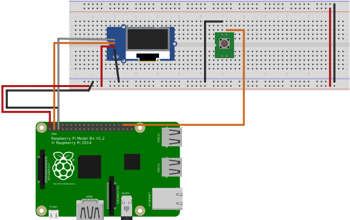
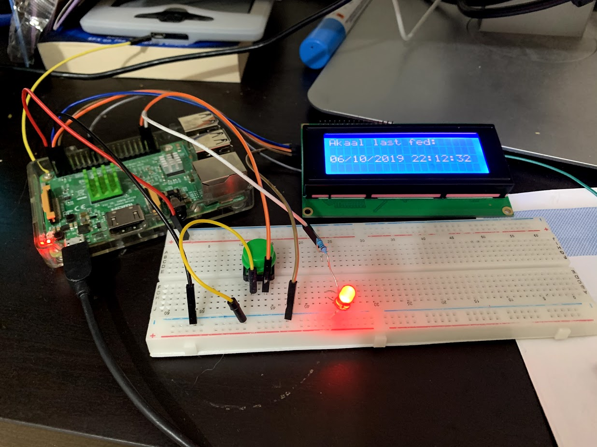

# Akaal Kaur - Doggy been Fed Switch

Raspberry Pi based switch with LCD used to record and display when our beloved doggy woggy has been fed so she can't dupe us and get fed twice - the dastardly dog.

Press the button to register when she's been fed:

- Displays date last fed on LCD display
- Ping IFTTT for mobile notifications etc
- Flashes LED


## Hardware required

- Raspberry Pi B+,Zero, 3, 4 or any internet enabled Pi
- [I2C](https://i2c.info/) enabled LCD/OLED [like this one](https://www.amazon.co.uk/gp/product/B07PWWTB94/ref=ppx_yo_dt_b_asin_title_o00_s00?ie=UTF8&psc=1)
- Breadboard/circuit board wires/solder
- Flashing Light - LED with 330Ohm resistor
- Physical push switch

### Wiring Diagram

- LCD i2C SDL - `Board Pin 3`
- LCD i2C SCL - `Board Pin 5`
- LED PullUp  - `Board Pin 37`
- Switch PullDown  - `Board Pin 36`



## To Deploy

- Ensure you've copied `.env.template` to `.env` and populated the environment variables required.
- Copy `provision-pi.sh` and your populated `.env` to a new [Raspbian Buster](https://www.raspberrypi.org/downloads/raspbian/) `/boot` partition
- Once Pi has finished booting for the first time and you've configured:
  - network(WiFi)
  - ssh connection & security
- Run `provision-pi.sh` as `root`:

  ```bash
  sudo su -
  bash provision-pi.sh
  ```

  This will:
      - Install all deps
      - checkout code to `/opt/akaal-switch`
      - setup updates, reboots etc...
      - setup code to run as daemon (using Systemd)
- Remember to populate and copy `.env` to `/opt/akaal-switch` if you have not already done so
- Wire up RasPi as per diagram
- Reboot and Test!

## TODO

- [x] print message to LCD screen
- [x] led flash sequence
- [x] wire up button
- ~~[ ] add speech/woof sound~~ (need DAC, onboard sound is noisy)
- [x] take photo of dev board
- [x] send IFTTT notification to write to gsheet and send mobile notifications
- [x] start script at boot
- [x] draw wiring diagram (fritzing)
- [x] pull latest script from github at boot
- [ ] re-install raspbian lite and redeploy w/ provision script
- [x] ensure pi has autoupdates on
- [ ] deploy prototype
    - [ ] take photo of prototype
- [ ] solder things up
- [ ] deploy prod
    - [ ] take photo of final setup

## Addendum

### Photos

Dev Board:


### Debug

- [RasPi 48pin Pinout](https://pinout.xyz/pinout/i2c)

ssh to pi

```bash
ssh pi@192.168.1.45
```

auto copy code to pi

```bash
inotify scp -r app/ pi@192.168.1.45:/home/pi/
```

debugging on pi

```bash
eval $(egrep -v '^#' .env | xargs) python3 app/run.py
```

## Licence

[MIT](LICENCE)
